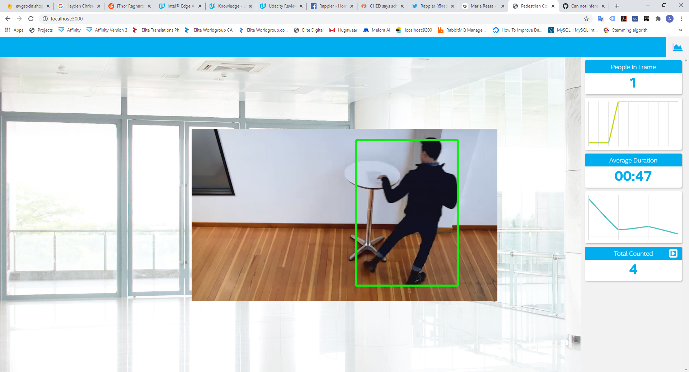
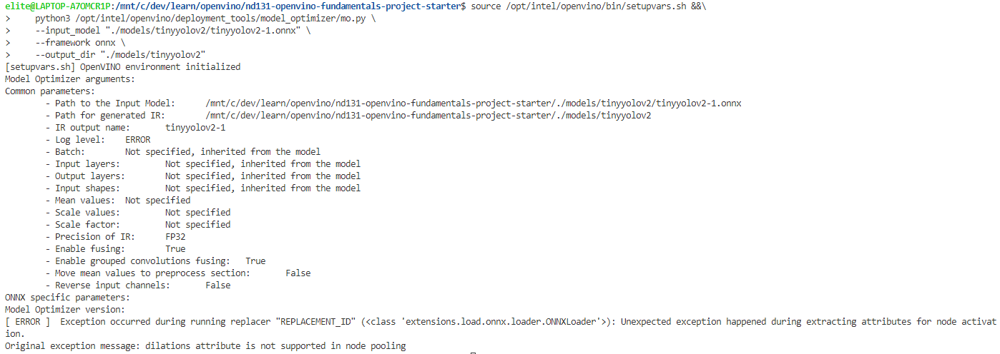

# People Counter Application



## Explaining Custom Layers

OpenVINO supports wide array of layers from myriad of frameworks particularly Tensorflow. But sometimes, defining a model that are not part of the list of OpenVINO's supported layers will undergo extra steps to convert the model to IR. Particularly in Tensorflow, converting custom layer involves the following three options, each are applicable for different use cases: (1) using extensions that are readily available in model optimizer extensions and (2) allow for the creation of a different subgraph and replacing the unsupported ones and finally, offload the computation back to Tensorflow during inference without replacing the unsupported layers.

Some of the potential reasons for handling custom layers are (1) the user supports a new version of Tensorflow API that uses different architecture like faster R-CNN, (2) subgraph is the easiest way to do to still process the layer output as long as there is a consistent formula for getting the same output from the layer as the ones from the original Tensorflow model and (3) the unsupported layer is complicated enough so the output must be sent back to the Tensorflow backend during inference.

## Comparing Model Performance

My method(s) to compare models before and after conversion to Intermediate Representations
were to (1) examine the model size of my pre-selected Tensorflow model across converted intermediate representations via OpenVINO and (2) observe the performance of the model using the video provided for both pre-converted and post-converted models.

For the Tensorflow model, I created a script (tensorflow-main.py) that is the somewhat the same as what inference.py and main.py for OpenVINO provides. You may look at the Colab notebook as baseline of my implementation [here](https://colab.research.google.com/github/tensorflow/hub/blob/master/examples/colab/object_detection.ipynb#scrollTo=6cPY9Ou4sWs_). The way we can run the script is the following:

```
python3 tensorflow-main.py <video file> <probability threshold>
```

The system ran locally with the following specifications:

1. OpenVINO version 2020.3.194
2. Ubuntu version 18.04 running on Windows Subsystem for Linux
3. Intel(R) Core(TM) i7-7600U CPU @ 2.80GHz (4 CPUs)
4. 12 GB RAM

### Model Size

The author chose ssd_mobilenet_v2_coco_2018_03_29 from TensorFlow 1 Detection Model Zoo with direct download of the tar.gz file [here](http://download.tensorflow.org/models/object_detection/ssd_mobilenet_v2_coco_2018_03_29.tar.gz). OpenVINO toolkit manages to decrease the model size footprint from 68.3 MB to 65.6 MB. 

Observing the physical memory footprint in the other hand, OpenVINO required on average 612 MB compared to main inference of OpenVINO with only 250 MB.

Furthermore, the author observed that given a small decrease in model size, OpenVINO compensated to its low memory requirement during load. 

### Model Performance

As for the model performance comparison of the two models, OpenVINO gains a significant decrease in prediction latency. Without opening the ffmpeg server and the web application, OpenVINO IR observes an average of 76.8 millisecond prediction time per frame compared to 153 millisecond on the pre-converted model.

For the probability threshold, there is not much difference in terms of model performance comparing 0.5, 0.4 and 0.2. The model outputs relatively the same performance and prediction latency.

## Assess Model Use Cases

As of this writing, the world is affected by COVID-19 crisis with which social distancing measures must be upheld. The author is inspired to extend this project to create an application that would detect people close to each other for monitoring and warning purposes. Another is a low-cost alarm system solution for small and medium enterprises to signal an alarm when suspected burglary is in place.

Each of these use cases would be useful because it runs on the edge without the need to connect to the Internet. Another advantage is since users are able to use state-of-the-art models using industry-standard frameworks like Tensorflow, one can use pre-trained models that would entail faster predictions right on the edge. 

## Assess Effects on End User Needs

Lighting, model accuracy, and camera focal length/image size have different effects on a
deployed edge model. The potential effects of each of these are as follows:

1. In terms of lighting and focal length/image especially when we want to offload video captures to a storage device, it may be deemed unusable for the user as it may be unidentifiable post offload.
2. Especially when you want to minify models from different frameworks supported by OpenVINO, you may sacrifice some accuracy depending on the quantization metric or precision you selected. So it depends upon the user's use case on which should be prioritized, accuracy or speed.

## Model Research

In investigating potential people counter models, I tried each of the following three models:

- Model 1: ONNX Yolo V3 (yolov3-10.onnx)
  - [Model Source](https://github.com/onnx/models/tree/master/vision/object_detection_segmentation/yolov3)
  - I converted the model to an Intermediate Representation using the following script:
```
cd models
mkdir yolov3
cd yolov3
wget https://github.com/onnx/models/raw/master/vision/object_detection_segmentation/yolov3/model/yolov3-10.onnx
cd ../../
source /opt/intel/openvino/bin/setupvars.sh &&\
    python3 /opt/intel/openvino/deployment_tools/model_optimizer/mo.py \
    --input_model "./models/yolov3/yolov3-10.onnx" \
    --framework onnx \
    --output_dir "./models/yolov3"
```
  - This should work becase per documentation, the model has 3 outputs. boxes: (1x'n_candidates'x4), the coordinates of all anchor boxes, scores: (1x80x'n_candidates'), the scores of all anchor boxes per class, indices: ('nbox'x3), selected indices from the boxes tensor. The selected index format is (batch_index, class_index, box_index). But the model optimizer cannot convert it due to the following error:


  
- Model 2: ONNX Tiny YOLOv2 (tiny-yolov2.onnx)
  - [Model Source](https://github.com/onnx/models/tree/master/vision/object_detection_segmentation/tiny-yolov2)
  - I converted the model to an Intermediate Representation with the following script:
```
cd models
mkdir tinyyolov2
wget https://github.com/onnx/models/raw/master/vision/object_detection_segmentation/tiny-yolov2/model/tinyyolov2-1.onnx
cd tinyyolov2
source /opt/intel/openvino/bin/setupvars.sh &&\
    python3 /opt/intel/openvino/deployment_tools/model_optimizer/mo.py \
    --input_model "./models/tinyyolov2/tinyyolov2-1.onnx" \
    --framework onnx \
    --output_dir "./models/tinyyolov2"
```
Conversion of the model, kind of like the first one did not work due to the following error:


- Model 3: Tensorflow 1.0 faster_rcnn_inception_v2_coco_2018_01_28
  - [Model Source](https://github.com/tensorflow/models/blob/master/research/object_detection/g3doc/tf1_detection_zoo.md)
  - I converted the model to an Intermediate Representation with the following script assuming that the model has been downloaded and extracted:
```
cd models
wget http://download.tensorflow.org/models/object_detection/faster_rcnn_inception_v2_coco_2018_01_28.tar.gz
tar -xvf faster_rcnn_inception_v2_coco_2018_01_28.tar.gz
cd ..
source /opt/intel/openvino/bin/setupvars.sh &&\
    python3 /opt/intel/openvino/deployment_tools/model_optimizer/mo.py \
    --input_model "./models/faster_rcnn_inception_v2_coco_2018_01_28/frozen_inference_graph.pb" \
    --tensorflow_object_detection_api_pipeline_config "./faster_rcnn_inception_v2_coco_2018_01_28/pipeline.config" \
    --reverse_input_channels \
    --tensorflow_use_custom_operations_config /opt/intel/openvino/deployment_tools/model_optimizer/extensions/front/tf/ssd_v2_support.json \
    --framework tf \
    --output_dir "./models/faster_rcnn_inception_v2_coco_2018_01_28"
```
  - The conversion works but it is just slow compared to the chosen model explained above. The inference per frame take significant time thus lead to the delays in output.

For the chosen model, the application runs with the following script:

```
python3 main.py -i resources/Pedestrian_Detect_2_1_1.mp4 -m models/ssd_mobilenet_v2_coco_2018_03_29/frozen_inference_graph.xml -l /opt/intel/openvino/deployment_tools/inference_engine/lib/intel64/libcpu_extension_sse4.so -d CPU -pt 0.4 | ffmpeg -v warning -f rawvideo -pixel_format bgr24 -video_size 768x432 -framerate 24 -i - http://0.0.0.0:3004/fac.ffm
```
